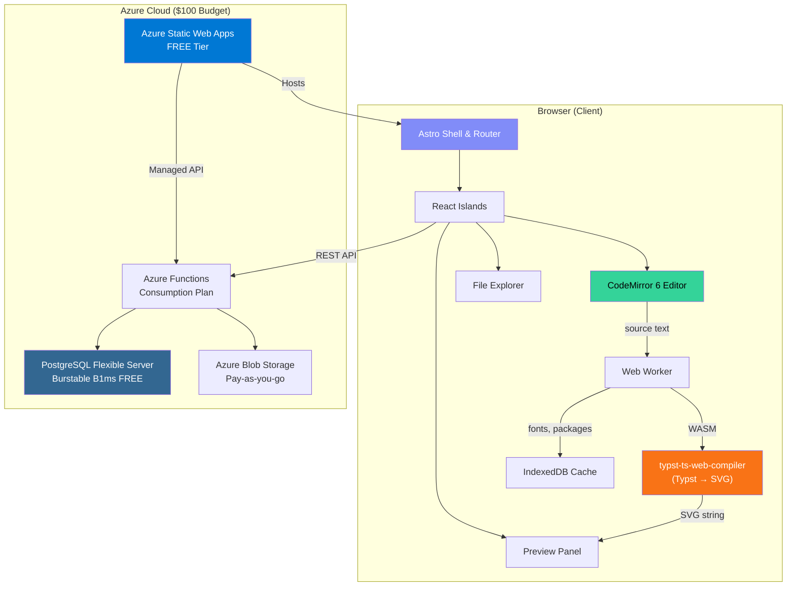
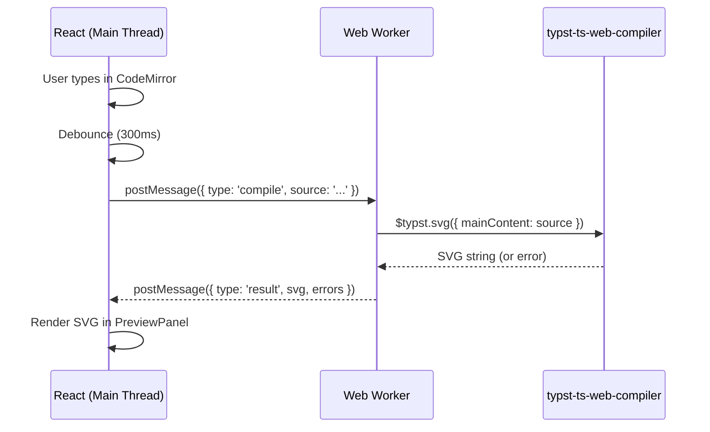
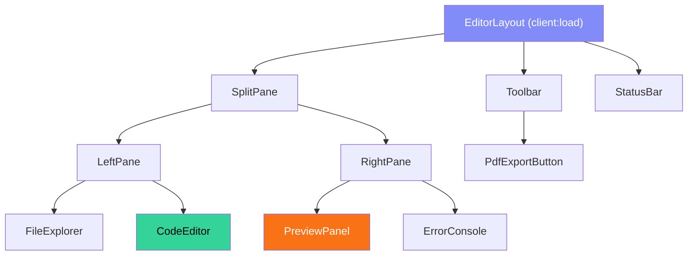

# Stitch UI — Typst SaaS IDE Architecture & Implementation Plan

A browser-based, single-player IDE for writing, previewing, and managing Typst documents. Inspired by Overleaf and typst.app, optimized for a $100 Azure student budget.

---

## User Review Required

> [!IMPORTANT]
> **Database Choice Change:** Azure Cosmos DB for PostgreSQL is **being retired** by Microsoft. This plan substitutes it with **Azure Database for PostgreSQL — Flexible Server** (Burstable B1ms), which is included in the Azure for Students free tier (750 hrs/month, 32 GB storage). This is a zero-cost change that is strictly better.

> [!WARNING]
> **Editor Choice:** The plan uses **CodeMirror 6** over Monaco Editor. CodeMirror 6 is ~80% smaller in bundle size (~150 KB vs ~1.5 MB), has first-class extensibility for custom Typst syntax highlighting, and works better with Astro's island architecture. If you strongly prefer Monaco, flag it now — the integration pattern changes significantly.

> [!IMPORTANT]
> **Typst WASM Strategy:** The plan uses `@myriaddreamin/typst.ts` (Form3 — full client-side compilation) via the `$typst.svg()` API inside a Web Worker. This is the proven approach used by typst.app itself. The alternative (Form2 — server precompilation) is rejected to honor the "zero server-side rendering for previews" constraint.

---

## 1. System Architecture Overview



### Key Architectural Decisions

| Decision | Choice | Rationale |
|:---------|:-------|:----------|
| Framework | Astro 5 | Static pages (landing, dashboard) ship zero JS. IDE page hydrates React islands. |
| UI Islands | React 19 | Stateful editor/preview require full React lifecycle. |
| Styling | Tailwind CSS v4 + Shadcn UI | Rapid, consistent UI. Shadcn gives us headless primitives. |
| Editor | CodeMirror 6 | Small bundle, extensible, custom Typst grammar support. |
| Typst Engine | `@myriaddreamin/typst.ts` v0.7.x | Compiles to SVG client-side via WASM. No server needed. |
| Worker Pattern | Dedicated Web Worker + Comlink | Non-blocking compilation. Main thread stays at 60fps. |
| Database | PostgreSQL Flexible Server | Free tier via Azure for Students. Relational model fits user/project metadata. |
| Auth | Azure Functions + JWT + bcrypt | Lightweight. No Azure AD dependency (overkill for MVP). |
| File Storage | Azure Blob Storage | Per-user containers. Cheap ($0.018/GB/month). |
| Deployment | Azure Static Web Apps | Free hosting, free SSL, custom domain, managed Functions. |

---

## 2. Azure Budget Breakdown ($100/year)

| Service | Tier | Monthly Cost | Notes |
|:--------|:-----|:-------------|:------|
| Static Web Apps | Free | $0 | 100 GB bandwidth, 2 custom domains |
| Azure Functions | Consumption | $0 | 1M free executions/month |
| PostgreSQL Flexible | B1ms (Free Tier) | $0 | 750 hrs/month, 32 GB storage — covered by student credits |
| Blob Storage | Hot tier | ~$0.50–2 | 10 GB @ $0.018/GB + transactions |
| **Total** | | **~$0.50–2/month** | Well within $100/year budget |

> [!TIP]
> Set Azure Budget alert at $8/month immediately after creating the subscription. This gives you 12 months of runway on $100.

---

## 3. Project Directory Structure

```
stitch-ui/
├── astro.config.mjs              # Astro config w/ React + Tailwind integrations
├── tailwind.config.mjs            # Tailwind CSS config
├── components.json                # Shadcn UI config
├── tsconfig.json                  # TypeScript base config
├── package.json
│
├── public/
│   ├── fonts/                     # Self-hosted subset fonts for Typst
│   │   ├── LinLibertine.woff2
│   │   ├── NewComputerModern.woff2
│   │   └── DejaVuSansMono.woff2
│   ├── wasm/                      # WASM binaries (copied at build time)
│   │   ├── typst_ts_web_compiler_bg.wasm
│   │   └── typst_ts_renderer_bg.wasm
│   ├── favicon.svg
│   └── og-image.png
│
├── src/
│   ├── components/
│   │   ├── ui/                    # Shadcn UI components (auto-generated)
│   │   │   ├── button.tsx
│   │   │   ├── dialog.tsx
│   │   │   ├── dropdown-menu.tsx
│   │   │   ├── input.tsx
│   │   │   ├── tabs.tsx
│   │   │   ├── toast.tsx
│   │   │   └── tooltip.tsx
│   │   │
│   │   ├── landing/               # Landing page components (Astro)
│   │   │   ├── Hero.astro
│   │   │   ├── Features.astro
│   │   │   ├── Pricing.astro
│   │   │   └── Footer.astro
│   │   │
│   │   ├── dashboard/             # Dashboard components (React islands)
│   │   │   ├── ProjectGrid.tsx
│   │   │   ├── ProjectCard.tsx
│   │   │   ├── NewProjectDialog.tsx
│   │   │   └── UserMenu.tsx
│   │   │
│   │   └── editor/                # IDE components (React islands)
│   │       ├── EditorLayout.tsx       # Master layout (split panes)
│   │       ├── CodeEditor.tsx         # CodeMirror 6 wrapper
│   │       ├── PreviewPanel.tsx       # SVG preview renderer
│   │       ├── FileExplorer.tsx       # Project file tree
│   │       ├── Toolbar.tsx            # Top toolbar (compile, export, settings)
│   │       ├── StatusBar.tsx          # Bottom status (errors, cursor pos)
│   │       ├── ErrorConsole.tsx       # Compilation error display
│   │       └── PdfExportButton.tsx    # Client-side PDF generation
│   │
│   ├── layouts/
│   │   ├── BaseLayout.astro       # Shared HTML shell (meta, fonts, globals)
│   │   ├── DashboardLayout.astro  # Authenticated dashboard shell
│   │   └── EditorLayout.astro     # Full-viewport editor shell
│   │
│   ├── pages/
│   │   ├── index.astro            # Landing page (static, zero JS)
│   │   ├── login.astro            # Login page
│   │   ├── register.astro         # Register page
│   │   ├── dashboard.astro        # Project dashboard (React island)
│   │   └── editor/
│   │       └── [projectId].astro  # IDE page (full React island)
│   │
│   ├── lib/
│   │   ├── utils.ts               # Tailwind cn() helper
│   │   ├── api.ts                 # REST API client (fetch wrapper)
│   │   ├── auth.ts                # JWT token management
│   │   └── constants.ts           # App-wide constants
│   │
│   ├── workers/
│   │   ├── typst-compiler.worker.ts   # Web Worker: Typst WASM compilation
│   │   └── typst-compiler.api.ts      # Comlink-wrapped API for the worker
│   │
│   ├── codemirror/
│   │   ├── typst-language.ts      # CodeMirror Typst language grammar (Lezer)
│   │   ├── typst-theme.ts         # CodeMirror dark/light theme
│   │   ├── typst-completion.ts    # Autocomplete provider
│   │   └── extensions.ts          # Extension bundle factory
│   │
│   ├── hooks/
│   │   ├── useTypstCompiler.ts    # React hook: manages worker lifecycle
│   │   ├── useProject.ts          # React hook: project CRUD
│   │   ├── useAuth.ts             # React hook: authentication state
│   │   └── useDebounce.ts         # Debounce utility hook
│   │
│   ├── stores/
│   │   └── editor-store.ts        # Zustand store for editor state
│   │
│   └── styles/
│       └── globals.css            # Tailwind directives + CSS variables
│
├── api/                           # Azure Functions (deployed via SWA)
│   ├── host.json
│   ├── package.json
│   ├── tsconfig.json
│   ├── src/
│   │   ├── functions/
│   │   │   ├── auth-register.ts   # POST /api/auth/register
│   │   │   ├── auth-login.ts      # POST /api/auth/login
│   │   │   ├── auth-me.ts         # GET  /api/auth/me
│   │   │   ├── projects-list.ts   # GET  /api/projects
│   │   │   ├── projects-create.ts # POST /api/projects
│   │   │   ├── projects-delete.ts # DELETE /api/projects/:id
│   │   │   ├── files-list.ts      # GET  /api/projects/:id/files
│   │   │   ├── files-read.ts      # GET  /api/projects/:id/files/:path
│   │   │   ├── files-write.ts     # PUT  /api/projects/:id/files/:path
│   │   │   └── files-delete.ts    # DELETE /api/projects/:id/files/:path
│   │   │
│   │   ├── middleware/
│   │   │   └── auth.ts            # JWT verification middleware
│   │   │
│   │   └── services/
│   │       ├── db.ts              # PostgreSQL connection (pg pool)
│   │       ├── storage.ts         # Azure Blob Storage client
│   │       └── jwt.ts             # JWT sign/verify helpers
│   │
│   └── migrations/
│       └── 001_initial.sql        # Database schema
│
└── infra/
    ├── main.bicep                 # Azure Bicep IaC (all resources)
    └── parameters.json
```

---

## 4. Data Model (PostgreSQL)

```sql
-- 001_initial.sql

CREATE TABLE users (
    id          UUID PRIMARY KEY DEFAULT gen_random_uuid(),
    email       VARCHAR(255) UNIQUE NOT NULL,
    password    VARCHAR(255) NOT NULL,  -- bcrypt hash
    name        VARCHAR(100) NOT NULL,
    created_at  TIMESTAMPTZ DEFAULT NOW(),
    updated_at  TIMESTAMPTZ DEFAULT NOW()
);

CREATE TABLE projects (
    id          UUID PRIMARY KEY DEFAULT gen_random_uuid(),
    user_id     UUID NOT NULL REFERENCES users(id) ON DELETE CASCADE,
    name        VARCHAR(255) NOT NULL,
    description TEXT DEFAULT '',
    main_file   VARCHAR(255) DEFAULT 'main.typ',
    blob_prefix VARCHAR(255) NOT NULL,  -- Azure Blob container path prefix
    created_at  TIMESTAMPTZ DEFAULT NOW(),
    updated_at  TIMESTAMPTZ DEFAULT NOW(),

    UNIQUE(user_id, name)
);

CREATE INDEX idx_projects_user_id ON projects(user_id);
```

> [!NOTE]
> **File storage is NOT in PostgreSQL.** Only metadata (user accounts, project entries) lives in the DB. Actual `.typ` files and assets are stored in Azure Blob Storage under the path `users/{userId}/projects/{projectId}/{filePath}`. This keeps DB costs near zero.

---

## 5. Core Component Design

### 5.1 Typst WASM Compilation Pipeline



#### `typst-compiler.worker.ts` (Pseudocode)

```typescript
// Web Worker — runs off main thread
import { $typst } from '@myriaddreamin/typst.ts/dist/esm/contrib/snippet.mjs';

// Initialize WASM modules
$typst.setCompilerInitOptions({
  getModule: () => new URL('/wasm/typst_ts_web_compiler_bg.wasm', self.location.origin).href,
});
$typst.setRendererInitOptions({
  getModule: () => new URL('/wasm/typst_ts_renderer_bg.wasm', self.location.origin).href,
});

// Pre-load fonts from /public/fonts/ or IndexedDB cache
await $typst.addFont(fontData); // for each font

self.onmessage = async (e) => {
  const { type, source, id } = e.data;

  if (type === 'compile') {
    try {
      const svg = await $typst.svg({ mainContent: source });
      self.postMessage({ type: 'result', id, svg, errors: [] });
    } catch (err) {
      self.postMessage({ type: 'result', id, svg: null, errors: [err.message] });
    }
  }

  if (type === 'pdf') {
    const pdf = await $typst.pdf({ mainContent: source });
    self.postMessage({ type: 'pdf', id, pdf }); // Uint8Array
  }
};
```

### 5.2 CodeMirror 6 Integration

```typescript
// codemirror/extensions.ts
import { basicSetup } from 'codemirror';
import { EditorView, keymap } from '@codemirror/view';
import { typstLanguage } from './typst-language';
import { typstThemeDark } from './typst-theme';
import { typstCompletion } from './typst-completion';

export function createEditorExtensions(onChange: (doc: string) => void) {
  return [
    basicSetup,
    typstLanguage(),
    typstThemeDark,
    typstCompletion,
    EditorView.updateListener.of((update) => {
      if (update.docChanged) {
        onChange(update.state.doc.toString());
      }
    }),
    keymap.of([
      // Ctrl+S → save to blob storage
      // Ctrl+Enter → force recompile
    ]),
  ];
}
```

### 5.3 Editor State Management (Zustand)

```typescript
// stores/editor-store.ts
import { create } from 'zustand';

interface EditorState {
  // Source
  source: string;
  setSource: (s: string) => void;

  // Preview
  svgOutput: string | null;
  compilationErrors: string[];
  isCompiling: boolean;
  setCompilationResult: (svg: string | null, errors: string[]) => void;

  // Files
  files: FileEntry[];
  activeFile: string;
  setActiveFile: (path: string) => void;

  // UI
  previewScale: number;
  showFileExplorer: boolean;
  splitRatio: number; // 0.0 to 1.0
}
```

### 5.4 React Component Hierarchy



---

## 6. API Design (Azure Functions)

### 6.1 Authentication Endpoints

| Method | Endpoint | Body | Response |
|:-------|:---------|:-----|:---------|
| POST | `/api/auth/register` | `{ email, password, name }` | `{ token, user }` |
| POST | `/api/auth/login` | `{ email, password }` | `{ token, user }` |
| GET | `/api/auth/me` | — (Bearer token) | `{ user }` |

### 6.2 Project Endpoints

| Method | Endpoint | Body | Response |
|:-------|:---------|:-----|:---------|
| GET | `/api/projects` | — | `{ projects: [...] }` |
| POST | `/api/projects` | `{ name, description? }` | `{ project }` |
| DELETE | `/api/projects/:id` | — | `204 No Content` |

### 6.3 File Endpoints (Blob Storage Proxied)

| Method | Endpoint | Body | Response |
|:-------|:---------|:-----|:---------|
| GET | `/api/projects/:id/files` | — | `{ files: [{ path, size, modified }] }` |
| GET | `/api/projects/:id/files/:path` | — | `{ content: "..." }` (text) |
| PUT | `/api/projects/:id/files/:path` | `{ content: "..." }` | `200 OK` |
| DELETE | `/api/projects/:id/files/:path` | — | `204 No Content` |

> [!NOTE]
> File reads/writes go through Azure Functions (not direct Blob SAS URLs) to enforce auth and keep the storage key server-side. For the MVP volume, this adds negligible latency.

---

## 7. Phased Development Roadmap

### Phase 1: Foundation (Week 1–2)
- [ ] Scaffold Astro 5 project with React + Tailwind + Shadcn
- [ ] Create landing page (static Astro, zero JS)
- [ ] Set up base layouts and global styles
- [ ] Configure Shadcn UI components (button, dialog, input, toast)
- [ ] Set up project structure (directories, tsconfig, aliases)

### Phase 2: Core IDE (Week 3–5)
- [ ] Integrate CodeMirror 6 with basic Typst syntax highlighting
- [ ] Set up typst.ts WASM compilation in Web Worker
- [ ] Build `useTypstCompiler` React hook with debounced compilation
- [ ] Create `EditorLayout` with resizable split panes
- [ ] Create `PreviewPanel` with SVG rendering and zoom controls
- [ ] Create `FileExplorer` component (local state, no backend yet)
- [ ] Build `Toolbar` and `StatusBar` components
- [ ] Implement client-side PDF export via `$typst.pdf()`
- [ ] Add error console for compilation diagnostics
- [ ] Create Zustand editor store

### Phase 3: Backend & Persistence (Week 6–8)
- [ ] Provision Azure resources (PostgreSQL, Blob Storage, SWA)
- [ ] Write Azure Bicep IaC template
- [ ] Implement auth Azure Functions (register, login, JWT)
- [ ] Implement project CRUD Azure Functions
- [ ] Implement file read/write Azure Functions (Blob Storage)
- [ ] Build login/register pages
- [ ] Build dashboard page with project grid
- [ ] Wire editor to backend (load/save files)
- [ ] Add auto-save with debounced PUT

### Phase 4: Polish & Deploy (Week 9–10)
- [ ] Configure Azure SWA with custom domain (choussa.me)
- [ ] Add dark/light theme toggle
- [ ] Performance audit (bundle splitting, lazy WASM loading)
- [ ] SEO optimization for landing page
- [ ] Error boundaries and loading states
- [ ] Set up Azure budget alerts
- [ ] CI/CD via GitHub Actions → Azure SWA

---

## 8. Key Technical Details

### 8.1 Font Strategy
Typst requires specific fonts to render correctly. The plan:
1. **Bundle 3 core fonts** in `/public/fonts/` as WOFF2 (~2 MB total): Linux Libertine (default), New Computer Modern (math), DejaVu Sans Mono (code).
2. **Cache in IndexedDB** after first load to avoid re-downloading.
3. The Web Worker loads fonts at initialization using `$typst.addFont()`.

### 8.2 WASM Module Loading
- WASM binaries (`~8 MB` compressed) are copied to `/public/wasm/` at build time via an npm `postinstall` script.
- The Web Worker references them by absolute URL. They are loaded asynchronously and cached by the service worker / HTTP cache.
- First-load time: ~3–5 seconds on broadband. Subsequent loads: near-instant (browser cache).

### 8.3 Debounce Strategy
- **Editor → Worker**: 300ms debounce on keystroke. Prevents excessive WASM invocations.
- **Editor → Blob Storage**: 2000ms debounce on save. Batches writes to minimize Azure Function invocations.

### 8.4 SplitPane
Use `react-resizable-panels` (4 KB, zero-dependency) for the editor/preview split. Supports drag resize and keyboard accessibility.

---

## Open Questions

> [!IMPORTANT]
> **1. Authentication Strategy:** The plan uses simple JWT + bcrypt (email/password). Do you want social login (GitHub OAuth, Google) instead/additionally? This affects Azure Function complexity.

> [!IMPORTANT]
> **2. Typst Package Support:** Should the MVP support importing Typst packages from `@preview/`? This requires the Web Worker to fetch packages at compile time (via a proxy or directly from the Typst package registry). It adds complexity but is essential for real-world Typst usage.

> [!WARNING]
> **3. Domain:** You mentioned `choussa.me` as the target domain. Is this already registered? Azure SWA needs DNS access (CNAME/TXT records on your registrar).

> [!IMPORTANT]
> **4. Tailwind CSS Version:** You specified Tailwind CSS. Astro 5 supports both Tailwind v3 and v4. Tailwind v4 has a new CSS-first configuration approach. Which version do you prefer? This plan assumes **v4** unless you say otherwise.

---

## Verification Plan

### Automated Tests
```bash
# Type-check the entire project
npx astro check

# Run unit tests (Vitest)
npx vitest run

# Build production bundle (verify no build errors)
npm run build
```

### Browser Tests
- Verify WASM loads and compiles `Hello, Typst!` in the editor
- Verify SVG preview renders correctly
- Verify PDF export downloads a valid file
- Verify login → dashboard → create project → open editor flow
- Verify file save/load round-trips through Blob Storage

### Manual Verification
- Lighthouse audit on landing page (target: 95+ Performance, 100 SEO)
- Mobile responsiveness check on editor (graceful degradation)
- Azure cost monitoring after 1 week of deployment
